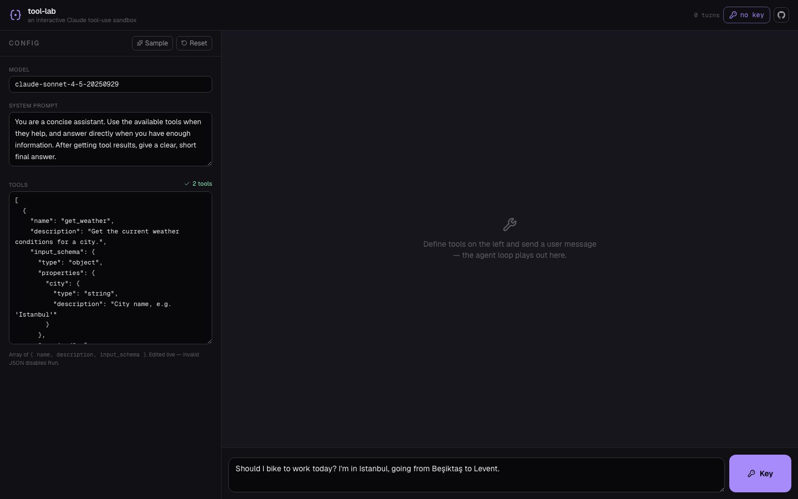

# tool-lab

**An interactive Claude tool-use sandbox.**

Define tools, send a user message, mock the tool responses — and watch the
agent loop play out live. The thing you want when you're building a Claude
agent and don't want to stand up real tool implementations yet.

Bring your own key. No backend. Nothing leaves your browser.

**[Live → tool-lab-bice.vercel.app](https://tool-lab-bice.vercel.app)**



---

## Why

Building an agent with Claude tool use means a lot of plumbing: write the
schema, run the call, parse the `tool_use` block, plug in a tool implementation,
feed the result back, run again. Most of that plumbing is what you'd skip
through anyway when you're still iterating on *which* tools your agent needs
and *how* the prompt steers them.

tool-lab takes the plumbing out: you write the tool schemas, hit run, and when
Claude calls a tool you type the result by hand. The loop runs end to end with
*you* in the role of every tool. Fast iteration on agent design.

## What it does

- **Define tools** — paste an array of `{ name, description, input_schema }`
  in the live JSON editor. Invalid JSON disables Run.
- **Send a user message** — pre-filled with a sensible sample, or type your own.
- **Run the loop** — Claude streams a response. If it includes `tool_use` blocks,
  the page shows an input form for each one.
- **You play every tool** — type whatever result you want, toggle `is_error`
  for failure cases, or hit *fill suggestion* for a pre-canned answer.
- **Continue** — your results get sent back as `tool_result` blocks; Claude
  streams again. Loop continues until it returns plain text (`end_turn`).
- **BYOK, zero backend** — requests go straight from your browser to Anthropic;
  the key lives in `localStorage`.

## Why this is useful

- **Design tools before you build them.** See what the model actually asks for
  before you write the tool implementation.
- **Stress-test prompts.** Make tools error, return garbage, return huge
  payloads — see how the agent recovers.
- **Demo agents.** Drive a multi-step loop in front of someone with full
  control over what every tool "returns."

## How it works

```
src/
  app/
    page.tsx          orchestration: state machine for the loop
    layout.tsx        metadata, OG card, JSON-LD
    globals.css       design tokens, dark theme
  components/
    ConfigPane.tsx    model · system · tools JSON · sample / reset
    ConversationView.tsx   the running message log
    InputArea.tsx     contextual: composer / tool-result inputs / stop
    KeyDialog.tsx     BYOK key entry
  lib/
    anthropic.ts      fetch-based streaming + SSE parser with tool_use support
    pricing.ts        tier-aware cost model
    sample.ts         the built-in sample (system, tools, user message)
    storage.ts        localStorage helpers
    types.ts          Message, Block, Tool, PendingToolUse
```

The SSE parser handles `tool_use` blocks specifically — it accumulates the
`input_json_delta` events per block and parses the full JSON at
`content_block_stop`. Text streams live, tool_use cards appear when complete.

## Run locally

```bash
npm install
npm run dev
# open http://localhost:3000
```

You'll need an Anthropic API key — create one at
[console.anthropic.com](https://console.anthropic.com/settings/keys).

## Deploy

Static-friendly, no environment variables. One-click on Vercel:

[](https://vercel.com/new/clone?repository-url=https://github.com/ferhatatagun/tool-lab)

## Read the story

The case for prototyping agents by hand-mocking tool responses before
writing the real implementations:

- [**Build the sandbox before you write a single tool**](https://ferhatatagun.com/blog/build-the-sandbox-first)
  — why "tool implementations are not the hard part of agent
  development; tool design is," with a worked example where 3 of 4
  initial tools didn't survive the first sandbox session — and the
  fifteen-minute exercise that saves a day of rework.

## A small suite

Four tools for seeing what Claude is doing, built together with a shared design language:

- [claudoscope](https://github.com/ferhatatagun/claudoscope) — x-ray your Claude API calls
- [agent-replay](https://github.com/ferhatatagun/agent-replay) — replay a static agent trace
- [prompt-lab](https://github.com/ferhatatagun/prompt-lab) — A/B test prompts side by side
- **tool-lab** — interactive tool-use sandbox *(this one)*

## Tech

Next.js 16 · React 19 · TypeScript · Tailwind CSS v4 · Framer Motion

## License

MIT — see [LICENSE](LICENSE).
